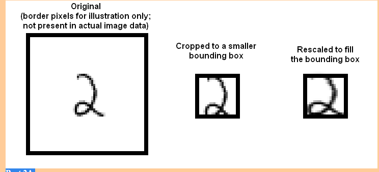

## (Naive Bayes Classifier from Scratch)
## Problem-1

A famous collection of data on whether a patient has diabetes, known as the Pima Indians dataset, and originally owned by the National Institute of Diabetes and Digestive and Kidney Diseases can be found at Kaggle. Download this dataset from https://www.kaggle.com/kumargh/pimaindiansdiabetescsv. This data has a set of attributes of patients, and a categorical variable telling whether the patient is diabetic or not. For several attributes in this data set, a value of 0 may indicate a missing value of the variable. There are a total of 767 data-points.

Part 1A Build a simple naive Bayes classifier to classify this data set. You should use a normal distribution to model each of the class-conditional distributions. You should write this classifier yourself (it's quite straight-forward). Compute an estimate of the accuracy of the classifier by averaging over 10 test-train splits. Each split should randomly assign 20% of the data to test, and the rest to train.

Part 1B Now adjust your code so that, for attribute 3 (Diastolic blood pressure), attribute 4 (Triceps skin fold thickness), attribute 6 (Body mass index), and attribute 8 (Age), it regards a value of 0 as a missing value when estimating the class-conditional distributions, and the posterior. R uses a special number NA to flag a missing value. Most functions handle this number in special, but sensible, ways; but you'll need to do a bit of looking at manuals to check. Compute an estimate of the accuracy of the classifier by averaging over 10 test-train splits. Each split should randomly assign 20% of the data to test, and the rest to train.

Part 1-D Now install SVMLight, which you can find at http://svmlight.joachims.org. Use this to to train and evaluate an SVM to classify this data. For training the model, use:
svmlight (features, labels, pathsvm)

## Problem-2

The MNIST dataset is a dataset of 60,000 training and 10,000 test examples of handwritten digits, originally constructed by Yann Lecun, Corinna Cortes, and Christopher J.C. Burges. It is very widely used to check simple methods. There are 10 classes in total ("0" to "9"). This dataset has been extensively studied, and there is a history of methods and feature construc- tions at https://en.wikipedia.org/wiki/MNIST_database and at the original site, http://yann.lecun.com/exdb/mnist/ . You should notice that the best methods perform extremely well.

You MUST use a version of the data we have set up as a Kaggle competition at https://www.kaggle.com/t/beaf4aad43984309aaa62e6674966205. We will use this version, with test-train splits that we have made. You can find this on the Kaggle competition page for this course, at https://www.kaggle.com/t/beaf4aad43984309aaa62e6674966205.

The dataset consists of 28 x 28 images. These were originally binary images, but appear to be grey level images as a result of some anti-aliasing. I will ignore mid grey pixels (there aren't many of them) and call dark pixels "ink pixels", and light pixels "paper pixels"; you can modify the data values with a threshold to specify the distinction, as described here https://en.wikipedia.org/wiki/Thresholding_(image_processing) . The digit has been centered in the image by centering the center of gravity of the image pixels, but as mentioned on the original site, this is probably not ideal. Here are some options for re-centering the digits that I will refer to in the exercises.

Untouched: Do not re-center the digits, but use the images as is.
Bounding box: Construct a 20 x 20 bounding box so that the horizontal (resp. vertical) range of ink pixels is centered in the box.
Stretched bounding box: Construct a 20 x 20 bounding box so that the horizontal (resp. vertical) range of ink pixels runs the full horizontal (resp. vertical) range of the box. Obtaining this representation will involve rescaling image pixels: you find the horizontal and vertical ink range, cut that out of the original image, then resize the result to 20 x 20. Once the image has been re-centered, you can compute features.
Here are some pictures, which may help

Part 2A
Investigate classifying MNIST using naive Bayes. Compute the accuracy values for the four combinations of Gaussian v. Bernoulli distributions and untouched images v. stretched bounding boxes. Please use 20 x 20 for your bounding box dimensions.

Part 2B Investigate classifying MNIST using a decision forest. For this you should use a library. For your forest construction, you should investigate four cases. Your cases are: number of trees = (10, 30) X maximum depth = (4, 16). You should compute your accuracy for each of the following cases: untouched raw pixels; stretched bounding box. This yields a total of 8 slightly different classifiers. Please use 20 x 20 for your bounding box dimensions.
