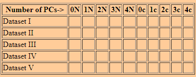

## Problem 1

The goal of this Homework is to use PCA to smooth the noise in the provided data. At https://www.kaggle.com/t/e9337b95218e48a1be69a69e3826688a , you will find a five noisy versions of the Iris dataset, and a noiseless version.

For each of the 5 noisy data sets, you should compute the principle components in two ways. In the first, you will use the mean and covariance matrix of the noiseless dataset. In the second, you will use the mean and covariance of the respective noisy datasets. Based on these components, you should compute the mean squared error between the noiseless version of the dataset and each of a PCA representation using 0 (i.e. every data item is represented by the mean), 1, 2, 3, and 4 principal components.

You should produce:

A. a one-page PDF showing your numbers filled in a table set out as below, where "N" columns represents the components calculated via the noiseless dataset and the "c" columns the noisy datasets.:
B. upload to Kaggle your reconstruction of the dataset of version II, expanded onto 2 principal components, where mean and principal components are computed from the dataset of version II

